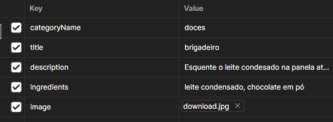

# Receitas App - backend com AdnoisJs

## O que é?

 API que possibilita a criação de usuários os quais podem publicar receitas, comentá-las, curti-las e favoritá-las de forma a interagir com outros usuários.

## Como utuliar?

### Criando um usuário

>POST  `/api/users/sign-up`

- Corpo da requisição JSON com o seguinte padrão:

   ```JSON
      {
        "username": "ana-maria-brogui",
        "email": "ana@brogui.com",
        "password": "senhasegura"
      }
  ```

### Logando um usuário

>POST `/api/users/login`

- Corpo da requisição: JSON com o seguinte padrão:
  
   ```JSON
      {
        "email": "ana@brogui.com",
        "password": "senhasegura"
      }
  ```

- Retorno: JWT com validade de 24 horas

  ```JSON
    "data": {
        "type": "bearer",
        "token": "MQ.nT4zbeQvOxwX3IjUpAi_fVgJTor-dU-nOT1OWVNWrciWzunS2B2uPT9-XSP9",
        "expires_at": "2023-07-14T13:31:01.804-03:00"
    }
  ```

### Deslogando um usuário

>POST `/api/users/logout`

- Retorno: Confirma a revovagação do token

  ```JSON
    {
      "revoked": true,
      "message": "Logout realizado com sucesso"
    }
  ```

## Rotas protegidas: ``Bearer token``

### Criando receita

>POST `/api/recipes`

- Exeplo de entrada: multipart/form-data

  

- Retorno esperado:

```JSON
{
    "data": {
        "id": 3,
        "title": "brigadeiro",
        "description": "Esquente o leite condesado na panela até pegar consistência, adicione o chocolate em pó, espere esfriar e está pronto",
        "category": "doces",
        "imageUrl": "/uploads/recipes/25bf3d54-0d1a-4e08-887c-ad57195ffb5a.jpg",
        "userName": "Ana-Maria-Brogui",
        "ingredients": [
            {
                "id": 7,
                "name": "leite condensado",
                "recipeName": "brigadeiro"
            },
            {
                "id": 8,
                "name": "chocolate em pó",
                "recipeName": "brigadeiro"
            }
        ],
        "metrics": {
            "likes": {
                "total likes": "0"
            },
            "favorites": {
                "total favorites": "0"
            },
            "comments": []
        },
        "createdAt": "2023-07-13T13:50:34.661-03:00",
        "updatedAt": "2023-07-13T13:50:34.661-03:00"
    }
}
```

### Listando todas as receitas

>GET `/api/recipes`

-Retorno esperado: array de receitas com o padrão acima

### Paginando receitas

>POST `/api/recipes/paginate`

-Exemplo de entrada:

```JSON
  {
    "pageNumber": "1",
    "recipePerPage": "5"
  }
```

### Listando receitas criadas pelo usuário

>GET `/api/recipes/user-recipes`

-Retorno esperado: array de receitas

### Listando receitas favoritadas pelo usuário

>GET `/api/recipes/user-favorite-recipes`

-Retorno: idem anterior

### Listando um receita pelo id

>GET `/api/recipes/:recipeId`

### Editando receita

>PUT `/api/recipes/:recipeId`

-Entrada esperada: multipart/form-data semelhante ao de criação

### Apagando receita

>DELETE `/api/recipes/:recipeId`

### Criando comentário em receita

>POST `/api/recipes/comment/:recipeId`

- Entrada esperada:

```JSON
  {
    "content": "Gostei muito! Fiz aqui e deu super certo"
  }
```

- Retorno esperado

```JSON
  {
    "data": {
        "id": 1,
        "username": "Ana-Maria-Brogui",
        "content": "Gostei muito! Fiz aqui e deu super certo",
        "recipeId": "1",
        "recipeName": "brigadeiro",
        "createdAt": "2023-07-13T14:06:30.660-03:00",
        "updatedAt": "2023-07-13T14:06:30.660-03:00"
    }
  }
```

### Apagando comentário de receita

>DELETE `/api/recipes/comment/:recipeId/commentId`

### Curtindo/Descurtindo receita

>POST `/api/recipes/like/:recipeId`
>
>DELETE `/api/recipes/unlike/:recipeId`

- Retorno esperado: quantidade de curtidas após a interação

```JSON
  {
    "total likes": "1"
  }
```

### Favoritando/Desfavoritando receita

>POST `/api/recipes/favorite/:recipeId`
>
>DELETE `/api/recipes/unfavorite/:recipeId`

- Retorno esperado: idem ao anterior

```JSON
  {
      "total favorites": "1"
  }
```
